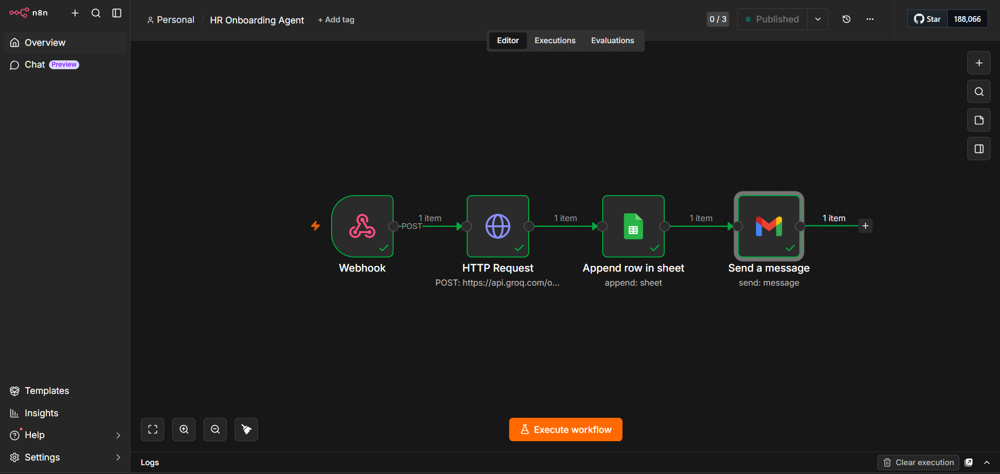
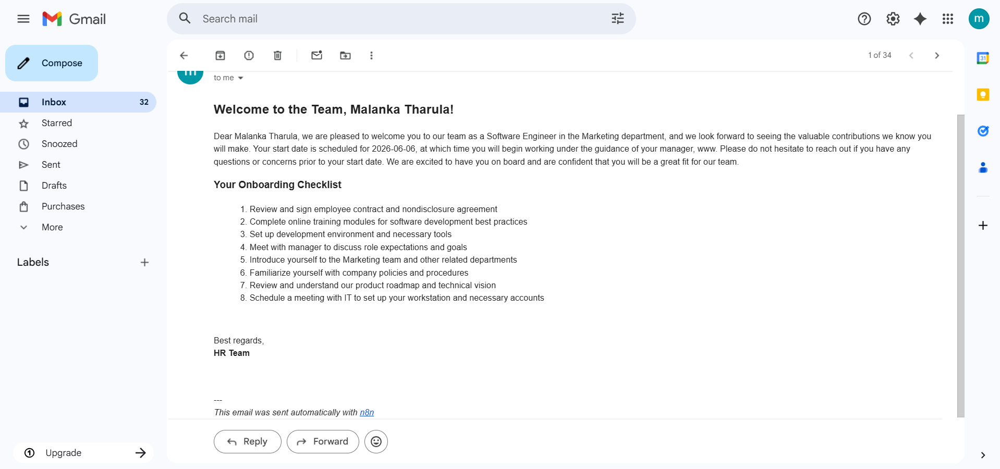

# HR Onboarding Agent 🤖

An AI-powered HR automation tool that handles the entire employee onboarding process with a single form submission — zero manual work.

## Live Demo

**Frontend:** [malankatharula.github.io/HROnboardingAgent](https://malankatharula.github.io/HROnboardingAgent)

---

## What It Does

Submit new employee details once. The agent automatically:

1. **Generates** a personalised welcome email and onboarding checklist using Groq AI (Llama 3.3 70B)
2. **Sends** the welcome email to the new employee via Gmail
3. **Logs** the employee record to a Google Sheet
4. **Confirms** completion — all in under 3 seconds

---

## Screenshots

| Web Form | n8n Workflow | Welcome Email |
|----------|-------------|---------------|
|  |  |  |

---

## Tech Stack

| Tool | Purpose |
|------|---------|
| n8n | Workflow automation engine |
| Groq API (Llama 3.3 70B) | AI email + checklist generation |
| Gmail API | Welcome email delivery |
| Google Sheets API | Employee data logging |
| HTML / CSS / JS | Frontend form |

---

## Architecture

```
Web Form (HTML/JS)
      │
      ▼ POST /webhook/hr-onboarding
   n8n Webhook
      │
      ▼
   HTTP Request → Groq API (Llama 3.3 70B)
      │           Generates welcome email + checklist
      │
      ├──▶ Gmail Node → Sends welcome email to employee
      │
      └──▶ Google Sheets Node → Logs record to HR sheet
```

---

## Setup & Run

### Prerequisites
- [n8n](https://n8n.io) running locally via Docker
- [Groq API key](https://console.groq.com) (free)
- Google Cloud project with Gmail API + Sheets API enabled
- OAuth2 credentials configured

### 1. Start n8n

```bash
docker run -it --rm --name n8n -p 5678:5678 docker.n8n.io/n8nio/n8n
```

### 2. Import the workflow

In n8n → **Workflows** → **Import from file** → select `workflow/hr_onboarding_workflow.json`

### 3. Configure credentials in n8n

- **Groq:** Add your API key as a Header Auth credential (`Authorization: Bearer YOUR_KEY`)
- **Gmail:** Connect via Google OAuth2
- **Google Sheets:** Connect via Google OAuth2, update the Sheet ID in the Sheets node

### 4. Publish the workflow

Click **Publish** in n8n to activate the production webhook.

### 5. Open the frontend

Open `frontend/index.html` in your browser. Fill in employee details and hit **Trigger Onboarding**.

---

## Google Sheet Structure

| Timestamp | Full Name | Email | Department | Position | Start Date | Manager | Status |
|-----------|-----------|-------|------------|----------|------------|---------|--------|

Sheet ID used: `1ZG1wbsTdQ9Jlh_liucDYBsQqw1JqGxIJqykZNiRyPws`

---

## Project Structure

```
HROnboardingAgent/
├── frontend/
│   └── index.html          # Web form UI
├── workflow/
│   └── hr_onboarding_workflow.json   # n8n workflow export
├── screenshots/            # Demo screenshots
└── README.md
```

---

## About

Built by [Malanka Tharula](https://linkedin.com/in/malanka-tharula-b329432a7) as part of a portfolio of AI automation projects targeting real business problems.

**Previous project:** [DocuAgent](https://github.com/malankatharula/DocuAgent) — AI document extraction web app (FastAPI + Groq + HuggingFace)